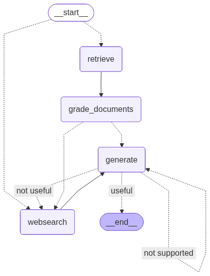

# Playground/RAG

Part of the [playground](https://github.com/commitBlob/playground) repository collection.

## LangGraph Agentic RAG

An intelligent question-answering system built with LangGraph that combines vector store retrieval and web search capabilities with sophisticated answer validation. The system uses an agent-based approach to dynamically decide the best information source and verify the quality of responses.

### Project Location

This project is located in the `RAG` directory of the playground repository:
```
playground/
└── RAG/                  # This project
    ├── ingestion.py
    ├── main.py
    └── graph/
        └── ...
```

## Features

- **Smart Routing**: Automatically routes questions to either vector store or web search based on the question's content
- **Document Relevance Grading**: Evaluates retrieved documents for relevance to the question
- **Hallucination Detection**: Verifies that generated answers are grounded in the source documents
- **Answer Quality Assessment**: Ensures generated responses actually answer the user's question
- **Fallback Mechanisms**: Dynamically switches to web search when vector store results are insufficient
- **Flexible Architecture**: Built with LangGraph for clear state management and workflow control

## Architecture

The system uses a state-based graph architecture with several key components:

1. **Router**: Determines whether to use vector store or web search based on the question
2. **Retriever**: Fetches relevant documents from Pinecone vector store
3. **Document Grader**: Evaluates document relevance
4. **Generator**: Creates answers based on retrieved documents
5. **Answer Grader**: Validates answers for hallucinations and relevance
6. **Web Search**: Provides additional information when needed using Tavily Search

## Setup

1. Clone the repository
2. Install dependencies:
   ```bash
   pip install langchain langchainhub langchain-community langchain-tavily langchain-pinecone langgraph python-dotenv pytest
   ```

3. Create a `.env` file with the following keys:
   ```
   OPENAI_API_KEY=your_openai_key
   PINECONE_API_KEY=your_pinecone_key
   TAVILY_API_KEY=your_tavily_key
   LANGSMITH_API_KEY=your_langsmith_key (optional)
   LANGSMITH_TRACING=true (optional)
   LANGSMITH_PROJECT_NAME=your_project_name (optional)
   
   ```

## Usage

1. Run the ingestion script to populate the vector store:
   ```bash
   python ingestion.py
   ```

2. Run the main application:
   ```bash
   python main.py
   ```

Example query:
```python
from graph.graph import app

result = app.invoke(input={"question": "What is agent memory?"})
print(result)
```

## Project Structure

```
├── ingestion.py          # Document ingestion and vector store setup
├── main.py              # Main application entry point
├── graph/
│   ├── chains/         # LangChain components
│   │   ├── answer_grader.py
│   │   ├── generation.py
│   │   ├── hallucination_grader.py
│   │   ├── retrieval_grader.py
│   │   └── router.py
│   ├── nodes/          # Graph nodes implementation
│   │   ├── generate.py
│   │   ├── grade_documents.py
│   │   ├── retrieve.py
│   │   └── web_search.py
│   ├── tests/          # Test cases
│   ├── graph.py        # Main graph definition
│   └── state.py        # State management
```

## Testing

Run the test suite:
```bash
pytest . -s -v
```

## Flow Visualization

The system generates a visual representation of the workflow graph in `graph_output.png`:



This visualization shows the complete flow of the question-answering system, including routing decisions, document retrieval, grading steps, and generation paths.